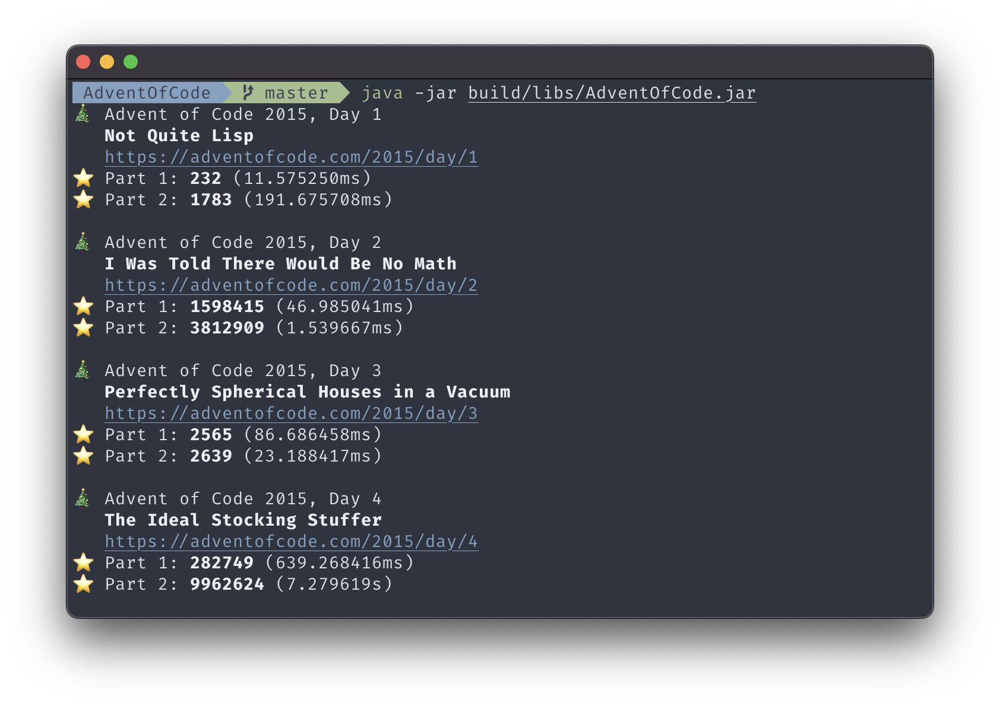

<h1 align="center">
    
    🎄 <a href="https://adventofcode.com">Advent of Code</a> 🎄
</h1>

    <strong>My solutions in Kotlin</strong>

    
    
    

## ⭐️ Progress

***Legend:** ★: Both stars for that day &bullet; ☆: Just the first star*

|  Year |  1 |  2 |  3 |  4 |  5 |  6 |  7 |  8 |  9 | 1 0 | 1 1 | 1 2 | 1 3 | 1 4 | 1 5 | 1 6 | 1 7 | 1 8 | 1 9 | 2 0 | 2 1 | 2 2 | 2 3 | 2 4 | 2 5 |  ★ |
|---------:|:-----:|:-----:|:-----:|:-----:|:-----:|:-----:|:-----:|:-----:|:-----:|:------:|:------:|:------:|:------:|:------:|:------:|:------:|:------:|:------:|:------:|:------:|:------:|:------:|:------:|:------:|:------:|------:|
|     2015 |  ★️   |   ★   |   ★   |   ★   |   ★   |   ★   |   ★   |   ★   |   ★   |   ★    |   ★    |   ★    |   ★    |   ★    |   ★    |   ★    |   ★    |   ★    |   ☆    |   ★    |        |        |        |        |        |    39 |
|     2016 |   ☆   |   ☆   |   ★   |   ★   |   ★   |   ★   |   ★   |       |       |        |        |   ★    |        |   ★    |        |   ★    |        |        |        |   ★    |        |        |        |        |   ☆    |    21 |
|     2017 |   ★   |   ★   |       |   ★   |   ★   |       |       |       |       |        |        |        |        |        |   ★    |        |        |        |        |        |        |        |        |        |        |    10 |
|     2018 |   ★   |   ★   |   ★   |       |   ★   |       |       |       |       |        |        |        |        |        |        |        |        |        |        |        |        |        |        |        |        |     8 |
|     2019 |   ★   |   ★   |       |   ★   |       |       |       |       |       |        |        |        |        |        |        |        |        |        |        |        |        |        |        |        |        |     6 |
|     2020 |   ★   |   ★   |   ★   |   ★   |   ★   |   ★   |   ★   |   ★   |   ★   |   ★    |   ★    |   ★    |   ★    |   ★    |   ★    |   ★    |   ★    |        |   ☆    |   ☆    |   ★    |   ★    |   ☆    |   ★    |   ☆    |    44 |
|     2021 |   ★   |   ★   |   ★   |   ★   |   ★   |   ★   |   ★   |   ★   |   ★   |   ★    |   ★    |        |   ★    |   ★    |        |        |        |        |        |        |        |        |        |        |        |    26 |
|     2022 |   ★   |   ★   |   ★   |   ★   |   ★   |   ★   |   ★   |   ★   |   ★   |   ★    |   ★    |   ★    |   ★    |        |        |        |        |        |        |        |   ☆    |        |        |        |   ☆    |    28 |
|     2023 |   ★   |   ★   |   ★   |   ★   |   ☆   |   ★   |   ☆   |       |       |        |        |        |        |        |        |        |        |        |        |        |        |        |        |        |        |    12 |
|     2024 |   ★   |   ★   |   ★   |   ★   |   ★   |   ★   |   ★   |   ★   |   ★   |   ★    |   ★    |   ★    |   ★    |   ★    |        |   ☆    |   ★    |        |   ★    |   ☆    |        |        |        |        |        |    34 |

## 🛷 How to run

Puzzles can be run using the Gradle `run` task or by executing the project's JAR file:

* All available puzzles (all years and days):  
  `./gradlew run` or `java -jar build/libs/AdventOfCode.jar`

* All puzzles for a given year:  
  `./gradlew run --args "2020"` or `java -jar build/libs/AdventOfCode.jar 2020`

* A single puzzle for a given year and day:  
  `./gradlew run --args "2020/25"` or `java -jar build/libs/AdventOfCode.jar 2020/25`

These arguments can be combined to run multiple puzzles, e.g.
`./gradlew run --args "2015/1 2019 2020/6 2020/7"` will run the first puzzle from 2015, then all puzzles from 2019 and lastly the 6th and
7th puzzle from 2020.

Runtimes that exceed 15s are highlighted in red.

## 🎅🏻 Structure

***Legend:** `XXXX`: Year (4 digits, e.g. `2020`) &bullet; `YY`: Day (leading zero, e.g. `07`) &bullet; `ZZZZ`: Puzzle name (UpperCamelCase,
e.g. `HandyHaversacks`)*

* Inputs go into `src/main/resources/inputs` and follow the naming convention `yearXXXX/dayYY.txt`
* Solutions go into `src/main/kotlin/adventofcode` and follow the naming convention `yearXXXX/DayYYZZZZ.kt`
* Solutions extend the `Puzzle` class and call its constructor passing an optional alternative input
* Solutions can have one or two parts sharing the same input. Not overriding `fun partTwo(): Any` will skip the second part when running the
  puzzle

## 🎁 Index

|                                      Year | Day | Puzzle                                                                                                 | Links                                                                                                                                                                                        | ⭐️ Part 1              | ⭐️ Part 2                                        |
|------------------------------------------:|----:|:-------------------------------------------------------------------------------------------------------|:---------------------------------------------------------------------------------------------------------------------------------------------------------------------------------------------|:-----------------------|:-------------------------------------------------|
| [**2015**](https://adventofcode.com/2015) |   1 | [Not Quite Lisp](https://adventofcode.com/2015/day/1)                                                  | [[Code](src/main/kotlin/adventofcode/year2015/Day01NotQuiteLisp.kt)]&nbsp;[[Test](src/test/kotlin/adventofcode/year2015/Day01NotQuiteLispSpec.kt)]                                           | `232`                  | `1783`                                           |
|                                           |   2 | [I Was Told There Would Be No Math](https://adventofcode.com/2015/day/2)                               | [[Code](src/main/kotlin/adventofcode/year2015/Day02IWasToldThereWouldBeNoMath.kt)]&nbsp;[[Test](src/test/kotlin/adventofcode/year2015/Day02IWasToldThereWouldBeNoMathSpec.kt)]               | `1598415`              | `3812909`                                        |
|                                           |   3 | [Perfectly&nbsp;Spherical&nbsp;Houses&nbsp;in&nbsp;a&nbsp;Vacuum](https://adventofcode.com/2015/day/3) | [[Code](src/main/kotlin/adventofcode/year2015/Day03PerfectlySphericalHousesInAVacuum.kt)]&nbsp;[[Test](src/test/kotlin/adventofcode/year2015/Day03PerfectlySphericalHousesInAVacuumSpec.kt)] | `2565`                 | `2639`                                           |
|                                           |   4 | [The Ideal Stocking Stuffer](https://adventofcode.com/2015/day/4)                                      | [[Code](src/main/kotlin/adventofcode/year2015/Day04TheIdealStockingStuffer.kt)]&nbsp;[[Test](src/test/kotlin/adventofcode/year2015/Day04TheIdealStockingStufferSpec.kt)]                     | `282749`               | `9962624`                                        |
|                                           |   5 | [Doesn't He Have Intern-Elves For This?](https://adventofcode.com/2015/day/5)                          | [[Code](src/main/kotlin/adventofcode/year2015/Day05DoesntHeHaveInternElvesForThis.kt)]&nbsp;[[Test](src/test/kotlin/adventofcode/year2015/Day05DoesntHeHaveInternElvesForThisSpec.kt)]       | `238`                  | `69`                                             |
|                                           |   6 | [Probably a Fire Hazard](https://adventofcode.com/2015/day/6)                                          | [[Code](src/main/kotlin/adventofcode/year2015/Day06ProbablyAFireHazard.kt)]&nbsp;[[Test](src/test/kotlin/adventofcode/year2015/Day06ProbablyAFireHazardSpec.kt)]                             | `377891`               | `14110788`                                       |
|                                           |   7 | [Some Assembly Required](https://adventofcode.com/2015/day/7)                                          | [[Code](src/main/kotlin/adventofcode/year2015/Day07SomeAssemblyRequired.kt)]                                                                                                                 | `16076`                | `2797`                                           |
|                                           |   8 | [Matchsticks](https://adventofcode.com/2015/day/8)                                                     | [[Code](src/main/kotlin/adventofcode/year2015/Day08Matchsticks.kt)]&nbsp;[[Test](src/test/kotlin/adventofcode/year2015/Day08MatchsticksSpec.kt)]                                             | `1333`                 | `2046`                                           |
|                                           |   9 | [All in a Single Night](https://adventofcode.com/2015/day/9)                                           | [[Code](src/main/kotlin/adventofcode/year2015/Day09AllInASingleNight.kt)]&nbsp;[[Test](src/test/kotlin/adventofcode/year2015/Day09AllInASingleNightSpec.kt)]                                 | `207`                  | `804`                                            |
|                                           |  10 | [Elves Look, Elves Say](https://adventofcode.com/2015/day/10)                                          | [[Code](src/main/kotlin/adventofcode/year2015/Day10ElvesLookElvesSay.kt)]                                                                                                                    | `492982`               | `6989950`                                        |
|                                           |  11 | [Corporate Policy](https://adventofcode.com/2015/day/11)                                               | [[Code](src/main/kotlin/adventofcode/year2015/Day11CorporatePolicy.kt)]&nbsp;[[Test](src/test/kotlin/adventofcode/year2015/Day11CorporatePolicySpec.kt)]                                     | `vzbxxyzz`             | `vzcaabcc`                                       |
|                                           |  12 | [JSAbacusFramework.io](https://adventofcode.com/2015/day/12)                                           | [[Code](src/main/kotlin/adventofcode/year2015/Day12JSAbacusFrameworkIo.kt)]&nbsp;[[Test](src/test/kotlin/adventofcode/year2015/Day12JSAbacusFrameworkIoSpec.kt)]                             | `111754`               | `65402`                                          |
|                                           |  13 | [Knights of the Dinner Table](https://adventofcode.com/2015/day/13)                                    | [[Code](src/main/kotlin/adventofcode/year2015/Day13KnightsOfTheDinnerTable.kt)]&nbsp;[[Test](src/test/kotlin/adventofcode/year2015/Day13KnightsOfTheDinnerTableSpec.kt)]                     | `618`                  | `601`                                            |
|                                           |  14 | [Reindeer Olympics](https://adventofcode.com/2015/day/14)                                              | [[Code](src/main/kotlin/adventofcode/year2015/Day14ReindeerOlympics.kt)]                                                                                                                     | `2696`                 | `1084`                                           |
|                                           |  15 | [Science for Hungry People](https://adventofcode.com/2015/day/15)                                      | [[Code](src/main/kotlin/adventofcode/year2015/Day15ScienceForHungryPeople.kt)]&nbsp;[[Test](src/test/kotlin/adventofcode/year2015/Day15ScienceForHungryPeopleSpec.kt)]                       | `21367368`             | `1766400`                                        |
|                                           |  16 | [Aunt Sue](https://adventofcode.com/2015/day/16)                                                       | [[Code](src/main/kotlin/adventofcode/year2015/Day16AuntSue.kt)]                                                                                                                              | `213`                  | `323`                                            |
|                                           |  17 | [No Such Thing as Too Much](https://adventofcode.com/2015/day/17)                                      | [[Code](src/main/kotlin/adventofcode/year2015/Day17NoSuchThingAsTooMuch.kt)]&nbsp;[[Test](src/test/kotlin/adventofcode/year2015/Day17NoSuchThingAsTooMuchSpec.kt)]                           | `1638`                 | `17`                                             |
|                                           |  18 | [Like a GIF For Your Yard](https://adventofcode.com/2015/day/18)                                       | [[Code](src/main/kotlin/adventofcode/year2015/Day18LikeAGifForYourYard.kt)]                                                                                                                  | `768`                  | `781`                                            |
|                                           |  19 | [Medicine for Rudolph](https://adventofcode.com/2015/day/19)                                           | [[Code](src/main/kotlin/adventofcode/year2015/Day19MedicineForRudolph.kt)]&nbsp;[[Test](src/test/kotlin/adventofcode/year2015/Day19MedicineForRudolphSpec.kt)]                               | `518`                  |                                                  |
|                                           |  20 | [Infinite Elves and Infinite Houses](https://adventofcode.com/2015/day/20)                             | [[Code](src/main/kotlin/adventofcode/year2015/Day20InfiniteElvesAndInfiniteHouses.kt)]&nbsp;[[Test](src/test/kotlin/adventofcode/year2015/Day20InfiniteElvesAndInfiniteHousesSpec.kt)]       | `665280`               | `705600`                                         |
| [**2016**](https://adventofcode.com/2016) |   3 | [Squares With Three Sides](https://adventofcode.com/2016/day/3)                                        | [[Code](src/main/kotlin/adventofcode/year2016/Day03SquaresWithThreeSides.kt)]&nbsp;[[Test](src/test/kotlin/adventofcode/year2016/Day03SquaresWithThreeSidesSpec.kt)]                         | `1050`                 | `1921`                                           |
|                                           |   4 | [Security Through Obscurity](https://adventofcode.com/2016/day/4)                                      | [[Code](src/main/kotlin/adventofcode/year2016/Day04SecurityThroughObscurity.kt)]&nbsp;[[Test](src/test/kotlin/adventofcode/year2016/Day04SecurityThroughObscuritySpec.kt)]                   | `185371`               | `984`                                            |
|                                           |   5 | [How About a Nice Game of Chess?](https://adventofcode.com/2016/day/5)                                 | [[Code](src/main/kotlin/adventofcode/year2016/Day05HowAboutANiceGameOfChess.kt)]&nbsp;[[Test](src/test/kotlin/adventofcode/year2016/Day05HowAboutANiceGameOfChessSpec.kt)]                   | `801b56a7`             | `424a0197`                                       |
|                                           |   6 | [Signals and Noise](https://adventofcode.com/2016/day/6)                                               | [[Code](src/main/kotlin/adventofcode/year2016/Day06SignalsAndNoise.kt)]&nbsp;[[Test](src/test/kotlin/adventofcode/year2016/Day06SignalsAndNoiseSpec.kt)]                                     | `mshjnduc`             | `apfeeebz`                                       |
|                                           |   7 | [Internet Protocol Version 7](https://adventofcode.com/2016/day/7)                                     | [[Code](src/main/kotlin/adventofcode/year2016/Day07InternetProtocolVersion7.kt)]&nbsp;[[Test](src/test/kotlin/adventofcode/year2016/Day07InternetProtocolVersion7Spec.kt)]                   | `115`                  | `231`                                            |
|                                           |  12 | [Leonardo's Monorail](https://adventofcode.com/2016/day/12)                                            | [[Code](src/main/kotlin/adventofcode/year2016/Day12LeonardosMonorail.kt)]&nbsp;[[Test](src/test/kotlin/adventofcode/year2016/Day12LeonardosMonorailSpec.kt)]                                 | `318009`               | `9227663`                                        |
|                                           |  14 | [One-Time Pad](https://adventofcode.com/2016/day/14)                                                   | [[Code](src/main/kotlin/adventofcode/year2016/Day14OneTimePad.kt)]&nbsp;[[Test](src/test/kotlin/adventofcode/year2016/Day14OneTimePadSpec.kt)]                                               | `15035`                |                                                  |
|                                           |  16 | [Dragon Checksum](https://adventofcode.com/2016/day/16)                                                | [[Code](src/main/kotlin/adventofcode/year2016/Day16DragonChecksum.kt)]&nbsp;[[Test](src/test/kotlin/adventofcode/year2016/Day16DragonChecksumSpec.kt)]                                       | `11111000111110000`    | `10111100110110100`                              |
|                                           |  20 | [Firewall Rules](https://adventofcode.com/2016/day/20)                                                 | [[Code](src/main/kotlin/adventofcode/year2016/Day20FirewallRules.kt)]&nbsp;[[Test](src/test/kotlin/adventofcode/year2016/Day20FirewallRulesSpec.kt)]                                         | `32259706`             | `113`                                            |
|                                           |  25 | [Clock Signal](https://adventofcode.com/2016/day/25)                                                   | [[Code](src/main/kotlin/adventofcode/year2016/Day25ClockSignal.kt)]                                                                                                                          | `158`                  |                                                  |
| [**2017**](https://adventofcode.com/2017) |   1 | [Inverse Captcha](https://adventofcode.com/2017/day/1)                                                 | [[Code](src/main/kotlin/adventofcode/year2017/Day01InverseCaptcha.kt)]&nbsp;[[Test](src/test/kotlin/adventofcode/year2017/Day01InverseCaptchaSpec.kt)]                                       | `1047`                 | `982`                                            |
|                                           |   2 | [Corruption Checksum](https://adventofcode.com/2017/day/2)                                             | [[Code](src/main/kotlin/adventofcode/year2017/Day02CorruptionChecksum.kt)]&nbsp;[[Test](src/test/kotlin/adventofcode/year2017/Day02CorruptionChecksumSpec.kt)]                               | `36766`                | `261`                                            |
|                                           |   4 | [High-Entropy Passphrases](https://adventofcode.com/2017/day/4)                                        | [[Code](src/main/kotlin/adventofcode/year2017/Day04HighEntropyPassphrases.kt)]&nbsp;[[Test](src/test/kotlin/adventofcode/year2017/Day04HighEntropyPassphrasesSpec.kt)]                       | `466`                  | `251`                                            |
|                                           |   5 | [A Maze of Twisty Trampolines, All Alike](https://adventofcode.com/2017/day/5)                         | [[Code](src/main/kotlin/adventofcode/year2017/Day05AMazeOfTwistyTrampolinesAllAlike.kt)]&nbsp;[[Test](src/test/kotlin/adventofcode/year2017/Day05AMazeOfTwistyTrampolinesAllAlikeSpec.kt)]   | `372671`               | `25608480`                                       |
|                                           |  15 | [Dueling Generators](https://adventofcode.com/2017/day/15)                                             | [[Code](src/main/kotlin/adventofcode/year2017/Day15DuelingGenerators.kt)]&nbsp;[[Test](src/test/kotlin/adventofcode/year2017/Day15DuelingGeneratorsSpec.kt)]                                 | `594`                  | `328`                                            |
| [**2018**](https://adventofcode.com/2018) |   1 | [Chronal Calibration](https://adventofcode.com/2018/day/1)                                             | [[Code](src/main/kotlin/adventofcode/year2018/Day01ChronalCalibration.kt)]&nbsp;[[Test](src/test/kotlin/adventofcode/year2018/Day01ChronalCalibrationSpec.kt)]                               | `522`                  | `73364`                                          |
|                                           |   2 | [Inventory Management System](https://adventofcode.com/2018/day/2)                                     | [[Code](src/main/kotlin/adventofcode/year2018/Day02InventoryManagementSystem.kt)]&nbsp;[[Test](src/test/kotlin/adventofcode/year2018/Day02InventoryManagementSystemSpec.kt)]                 | `4693`                 | `pebjqsalrdnckzfihvtxysomg`                      |
|                                           |   3 | [No Matter How You Slice It](https://adventofcode.com/2018/day/3)                                      | [[Code](src/main/kotlin/adventofcode/year2018/Day03NoMatterHowYouSliceIt.kt)]&nbsp;[[Test](src/test/kotlin/adventofcode/year2018/Day03NoMatterHowYouSliceItSpec.kt)]                         | `109143`               | `506`                                            |
|                                           |   5 | [Alchemical Reduction](https://adventofcode.com/2018/day/5)                                            | [[Code](src/main/kotlin/adventofcode/year2018/Day05AlchemicalReduction.kt)]&nbsp;[[Test](src/test/kotlin/adventofcode/year2018/Day05AlchemicalReductionSpec.kt)]                             | `11668`                | `4652`                                           |
| [**2019**](https://adventofcode.com/2019) |   1 | [The Tyranny of the Rocket Equation](https://adventofcode.com/2019/day/1)                              | [[Code](src/main/kotlin/adventofcode/year2019/Day01TheTyrannyOfTheRocketEquation.kt)]                                                                                                        | `3392373`              | `5085699`                                        |
|                                           |   2 | [1202 Program Alarm](https://adventofcode.com/2019/day/2)                                              | [[Code](src/main/kotlin/adventofcode/year2019/Day021202ProgramAlarm.kt)]                                                                                                                     | `3716250`              | `6472`                                           |
| [**2020**](https://adventofcode.com/2020) |   1 | [Report Repair](https://adventofcode.com/2020/day/1)                                                   | [[Code](src/main/kotlin/adventofcode/year2020/Day01ReportRepair.kt)]&nbsp;[[Test](src/test/kotlin/adventofcode/year2020/Day01ReportRepairSpec.kt)]                                           | `1005459`              | `92643264`                                       |
|                                           |   2 | [Password Philosophy](https://adventofcode.com/2020/day/2)                                             | [[Code](src/main/kotlin/adventofcode/year2020/Day02PasswordPhilosophy.kt)]&nbsp;[[Test](src/test/kotlin/adventofcode/year2020/Day02PasswordPhilosophySpec.kt)]                               | `493`                  | `593`                                            |
|                                           |   3 | [Toboggan Trajectory](https://adventofcode.com/2020/day/3)                                             | [[Code](src/main/kotlin/adventofcode/year2020/Day03TobogganTrajectory.kt)]&nbsp;[[Test](src/test/kotlin/adventofcode/year2020/Day03TobogganTrajectorySpec.kt)]                               | `280`                  | `4355551200`                                     |
|                                           |   4 | [Passport Processing](https://adventofcode.com/2020/day/4)                                             | [[Code](src/main/kotlin/adventofcode/year2020/Day04PassportProcessing.kt)]&nbsp;[[Test](src/test/kotlin/adventofcode/year2020/Day04PassportProcessingSpec.kt)]                               | `216`                  | `150`                                            |
|                                           |   5 | [Binary Boarding](https://adventofcode.com/2020/day/5)                                                 | [[Code](src/main/kotlin/adventofcode/year2020/Day05BinaryBoarding.kt)]&nbsp;[[Test](src/test/kotlin/adventofcode/year2020/Day05BinaryBoardingSpec.kt)]                                       | `842`                  | `617`                                            |
|                                           |   6 | [Custom Customs](https://adventofcode.com/2020/day/6)                                                  | [[Code](src/main/kotlin/adventofcode/year2020/Day06CustomCustoms.kt)]&nbsp;[[Test](src/test/kotlin/adventofcode/year2020/Day06CustomCustomsSpec.kt)]                                         | `6530`                 | `3323`                                           |
|                                           |   7 | [Handy Haversacks](https://adventofcode.com/2020/day/7)                                                | [[Code](src/main/kotlin/adventofcode/year2020/Day07HandyHaversacks.kt)]&nbsp;[[Test](src/test/kotlin/adventofcode/year2020/Day07HandyHaversacksSpec.kt)]                                     | `213`                  | `38426`                                          |
|                                           |   8 | [Handheld Halting](https://adventofcode.com/2020/day/8)                                                | [[Code](src/main/kotlin/adventofcode/year2020/Day08HandheldHalting.kt)]&nbsp;[[Test](src/test/kotlin/adventofcode/year2020/Day08HandheldHaltingSpec.kt)]                                     | `1939`                 | `2212`                                           |
|                                           |   9 | [Encoding Error](https://adventofcode.com/2020/day/9)                                                  | [[Code](src/main/kotlin/adventofcode/year2020/Day09EncodingError.kt)]                                                                                                                        | `1492208709`           | `238243506`                                      |
|                                           |  10 | [Adapter Array](https://adventofcode.com/2020/day/10)                                                  | [[Code](src/main/kotlin/adventofcode/year2020/Day10AdapterArray.kt)]&nbsp;[[Test](src/test/kotlin/adventofcode/year2020/Day10AdapterArraySpec.kt)]                                           | `2590`                 | `226775649501184`                                |
|                                           |  11 | [Seating System](https://adventofcode.com/2020/day/11)                                                 | [[Code](src/main/kotlin/adventofcode/year2020/Day11SeatingSystem.kt)]&nbsp;[[Test](src/test/kotlin/adventofcode/year2020/Day11SeatingSystemSpec.kt)]                                         | `2386`                 | `2091`                                           |
|                                           |  12 | [Rain Risk](https://adventofcode.com/2020/day/12)                                                      | [[Code](src/main/kotlin/adventofcode/year2020/Day12RainRisk.kt)]&nbsp;[[Test](src/test/kotlin/adventofcode/year2020/Day12RainRiskSpec.kt)]                                                   | `1533`                 | `25235`                                          |
|                                           |  13 | [Shuttle Search](https://adventofcode.com/2020/day/13)                                                 | [[Code](src/main/kotlin/adventofcode/year2020/Day13ShuttleSearch.kt)]&nbsp;[[Test](src/test/kotlin/adventofcode/year2020/Day13ShuttleSearchSpec.kt)]                                         | `370`                  | `894954360381385`                                |
|                                           |  14 | [Docking Data](https://adventofcode.com/2020/day/14)                                                   | [[Code](src/main/kotlin/adventofcode/year2020/Day14DockingData.kt)]&nbsp;[[Test](src/test/kotlin/adventofcode/year2020/Day14DockingDataSpec.kt)]                                             | `14862056079561`       | `3296185383161`                                  |
|                                           |  15 | [Rambunctious Recitation](https://adventofcode.com/2020/day/15)                                        | [[Code](src/main/kotlin/adventofcode/year2020/Day15RambunctiousRecitation.kt)]&nbsp;[[Test](src/test/kotlin/adventofcode/year2020/Day15RambunctiousRecitationSpec.kt)]                       | `206`                  | `955`                                            |
|                                           |  16 | [Ticket Translation](https://adventofcode.com/2020/day/16)                                             | [[Code](src/main/kotlin/adventofcode/year2020/Day16TicketTranslation.kt)]&nbsp;[[Test](src/test/kotlin/adventofcode/year2020/Day16TicketTranslationSpec.kt)]                                 | `22000`                | `410460648673`                                   |
|                                           |  17 | [Conway Cubes](https://adventofcode.com/2020/day/17)                                                   | [[Code](src/main/kotlin/adventofcode/year2020/Day17ConwayCubes.kt)]&nbsp;[[Test](src/test/kotlin/adventofcode/year2020/Day17ConwayCubesSpec.kt)]                                             | `362`                  | `1980`                                           |
|                                           |  19 | [Monster Messages](https://adventofcode.com/2020/day/19)                                               | [[Code](src/main/kotlin/adventofcode/year2020/Day19MonsterMessages.kt)]&nbsp;[[Test](src/test/kotlin/adventofcode/year2020/Day19MonsterMessagesSpec.kt)]                                     | `151`                  |                                                  |
|                                           |  20 | [Jurassic Jigsaw](https://adventofcode.com/2020/day/20)                                                | [[Code](src/main/kotlin/adventofcode/year2020/Day20JurassicJigsaw.kt)]&nbsp;[[Test](src/test/kotlin/adventofcode/year2020/Day20JurassicJigsawSpec.kt)]                                       | `68781323018729`       |                                                  |
|                                           |  21 | [Allergen Assessment](https://adventofcode.com/2020/day/21)                                            | [[Code](src/main/kotlin/adventofcode/year2020/Day21AllergenAssessment.kt)]&nbsp;[[Test](src/test/kotlin/adventofcode/year2020/Day21AllergenAssessmentSpec.kt)]                               | `2078`                 | `lmcqt,kcddk,npxrdnd,cfb,ldkt,fqpt,jtfmtpd,tsch` |
|                                           |  22 | [Crab Combat](https://adventofcode.com/2020/day/22)                                                    | [[Code](src/main/kotlin/adventofcode/year2020/Day22CrabCombat.kt)]&nbsp;[[Test](src/test/kotlin/adventofcode/year2020/Day22CrabCombatSpec.kt)]                                               | `33434`                | `31657`                                          |
|                                           |  23 | [Crab Cups](https://adventofcode.com/2020/day/23)                                                      | [[Code](src/main/kotlin/adventofcode/year2020/Day23CrabCups.kt)]&nbsp;[[Test](src/test/kotlin/adventofcode/year2020/Day23CrabCupsSpec.kt)]                                                   | `97632548`             |                                                  |
|                                           |  24 | [Lobby Layout](https://adventofcode.com/2020/day/24)                                                   | [[Code](src/main/kotlin/adventofcode/year2020/Day24LobbyLayout.kt)]&nbsp;[[Test](src/test/kotlin/adventofcode/year2020/Day24LobbyLayoutSpec.kt)]                                             | `269`                  | `3667`                                           |
|                                           |  25 | [Combo Breaker](https://adventofcode.com/2020/day/25)                                                  | [[Code](src/main/kotlin/adventofcode/year2020/Day25ComboBreaker.kt)]&nbsp;[[Test](src/test/kotlin/adventofcode/year2020/Day25ComboBreakerSpec.kt)]                                           | `3286137`              |                                                  |
| [**2021**](https://adventofcode.com/2021) |   1 | [Sonar Sweep](https://adventofcode.com/2021/day/1)                                                     | [[Code](src/main/kotlin/adventofcode/year2021/Day01SonarSweep.kt)]&nbsp;[[Test](src/test/kotlin/adventofcode/year2021/Day01SonarSweepSpec.kt)]                                               | `1696`                 | `1737`                                           |
|                                           |   2 | [Dive!](https://adventofcode.com/2021/day/2)                                                           | [[Code](src/main/kotlin/adventofcode/year2021/Day02Dive.kt)]&nbsp;[[Test](src/test/kotlin/adventofcode/year2021/Day02DiveSpec.kt)]                                                           | `1762050`              | `1855892637`                                     |
|                                           |   3 | [Binary Diagnostic](https://adventofcode.com/2021/day/3)                                               | [[Code](src/main/kotlin/adventofcode/year2021/Day03BinaryDiagnostic.kt)]&nbsp;[[Test](src/test/kotlin/adventofcode/year2021/Day03BinaryDiagnosticSpec.kt)]                                   | `2967914`              | `7041258`                                        |
|                                           |   4 | [Giant Squid](https://adventofcode.com/2021/day/4)                                                     | [[Code](src/main/kotlin/adventofcode/year2021/Day04GiantSquid.kt)]&nbsp;[[Test](src/test/kotlin/adventofcode/year2021/Day04GiantSquidSpec.kt)]                                               | `38913`                | `16836`                                          |
|                                           |   5 | [Hydrothermal Venture](https://adventofcode.com/2021/day/5)                                            | [[Code](src/main/kotlin/adventofcode/year2021/Day05HydrothermalVenture.kt)]&nbsp;[[Test](src/test/kotlin/adventofcode/year2021/Day05HydrothermalVentureSpec.kt)]                             | `3990`                 | `21305`                                          |
|                                           |   6 | [Lanternfish](https://adventofcode.com/2021/day/6)                                                     | [[Code](src/main/kotlin/adventofcode/year2021/Day06Lanternfish.kt)]&nbsp;[[Test](src/test/kotlin/adventofcode/year2021/Day06LanternfishSpec.kt)]                                             | `359999`               | `1631647919273`                                  |
|                                           |   7 | [The Treachery of Whales](https://adventofcode.com/2021/day/7)                                         | [[Code](src/main/kotlin/adventofcode/year2021/Day07TheTreacheryOfWhales.kt)]&nbsp;[[Test](src/test/kotlin/adventofcode/year2021/Day07TheTreacheryOfWhalesSpec.kt)]                           | `328187`               | `91257582`                                       |
|                                           |   8 | [Seven Segment Search](https://adventofcode.com/2021/day/8)                                            | [[Code](src/main/kotlin/adventofcode/year2021/Day08SevenSegmentSearch.kt)]&nbsp;[[Test](src/test/kotlin/adventofcode/year2021/Day08SevenSegmentSearchSpec.kt)]                               | `288`                  | `940724`                                         |
|                                           |   9 | [Smoke Basin](https://adventofcode.com/2021/day/9)                                                     | [[Code](src/main/kotlin/adventofcode/year2021/Day09SmokeBasin.kt)]&nbsp;[[Test](src/test/kotlin/adventofcode/year2021/Day09SmokeBasinSpec.kt)]                                               | `544`                  | `1017792`                                        |
|                                           |  10 | [Syntax Scoring](https://adventofcode.com/2021/day/10)                                                 | [[Code](src/main/kotlin/adventofcode/year2021/Day10SyntaxScoring.kt)]&nbsp;[[Test](src/test/kotlin/adventofcode/year2021/Day10SyntaxScoringSpec.kt)]                                         | `319233`               | `1118976874`                                     |
|                                           |  11 | [Dumbo Octopus](https://adventofcode.com/2021/day/11)                                                  | [[Code](src/main/kotlin/adventofcode/year2021/Day11DumboOctopus.kt)]&nbsp;[[Test](src/test/kotlin/adventofcode/year2021/Day11DumboOctopusSpec.kt)]                                           | `1640`                 | `312`                                            |
|                                           |  13 | [Transparent Origami](https://adventofcode.com/2021/day/13)                                            | [[Code](src/main/kotlin/adventofcode/year2021/Day13TransparentOrigami.kt)]&nbsp;[[Test](src/test/kotlin/adventofcode/year2021/Day13TransparentOrigamiSpec.kt)]                               | `671`                  | `PCPHARKL`                                       |
|                                           |  14 | [Extended Polymerization](https://adventofcode.com/2021/day/14)                                        | [[Code](src/main/kotlin/adventofcode/year2021/Day14ExtendedPolymerization.kt)]&nbsp;[[Test](src/test/kotlin/adventofcode/year2021/Day14ExtendedPolymerizationSpec.kt)]                       | `2584`                 | `3816397135460`                                  |
| [**2022**](https://adventofcode.com/2022) |   1 | [Calorie Counting](https://adventofcode.com/2022/day/1)                                                | [[Code](src/main/kotlin/adventofcode/year2022/Day01CalorieCounting.kt)]&nbsp;[[Test](src/test/kotlin/adventofcode/year2022/Day01CalorieCountingSpec.kt)]                                     | `72240`                | `210957`                                         |
|                                           |   2 | [Rock Paper Scissors](https://adventofcode.com/2022/day/2)                                             | [[Code](src/main/kotlin/adventofcode/year2022/Day02RockPaperScissors.kt)]&nbsp;[[Test](src/test/kotlin/adventofcode/year2022/Day02RockPaperScissorsSpec.kt)]                                 | `12458`                | `12683`                                          |
|                                           |   3 | [Rucksack Reorganization](https://adventofcode.com/2022/day/3)                                         | [[Code](src/main/kotlin/adventofcode/year2022/Day03RucksackReorganization.kt)]&nbsp;[[Test](src/test/kotlin/adventofcode/year2022/Day03RucksackReorganizationSpec.kt)]                       | `7878`                 | `2760`                                           |
|                                           |   4 | [Camp Cleanup](https://adventofcode.com/2022/day/4)                                                    | [[Code](src/main/kotlin/adventofcode/year2022/Day04CampCleanup.kt)]&nbsp;[[Test](src/test/kotlin/adventofcode/year2022/Day04CampCleanupSpec.kt)]                                             | `599`                  | `928`                                            |
|                                           |   5 | [Supply Stacks](https://adventofcode.com/2022/day/5)                                                   | [[Code](src/main/kotlin/adventofcode/year2022/Day05SupplyStacks.kt)]&nbsp;[[Test](src/test/kotlin/adventofcode/year2022/Day05SupplyStacksSpec.kt)]                                           | `JCMHLVGMG`            | `LVMRWSSPZ`                                      |
|                                           |   6 | [Tuning Trouble](https://adventofcode.com/2022/day/6)                                                  | [[Code](src/main/kotlin/adventofcode/year2022/Day06TuningTrouble.kt)]&nbsp;[[Test](src/test/kotlin/adventofcode/year2022/Day06TuningTroubleSpec.kt)]                                         | `1282`                 | `3513`                                           |
|                                           |   7 | [No Space Left On Device](https://adventofcode.com/2022/day/7)                                         | [[Code](src/main/kotlin/adventofcode/year2022/Day07NoSpaceLeftOnDevice.kt)]&nbsp;[[Test](src/test/kotlin/adventofcode/year2022/Day07NoSpaceLeftOnDeviceSpec.kt)]                             | `1084134`              | `6183184`                                        |
|                                           |   8 | [Treetop Tree House](https://adventofcode.com/2022/day/8)                                              | [[Code](src/main/kotlin/adventofcode/year2022/Day08TreetopTreeHouse.kt)]&nbsp;[[Test](src/test/kotlin/adventofcode/year2022/Day08TreetopTreeHouseSpec.kt)]                                   | `1708`                 | `504000`                                         |
|                                           |   9 | [Rope Bridge](https://adventofcode.com/2022/day/9)                                                     | [[Code](src/main/kotlin/adventofcode/year2022/Day09RopeBridge.kt)]&nbsp;[[Test](src/test/kotlin/adventofcode/year2022/Day09RopeBridgeSpec.kt)]                                               | `6011`                 | `2419`                                           |
|                                           |  10 | [Cathode-Ray Tube](https://adventofcode.com/2022/day/10)                                               | [[Code](src/main/kotlin/adventofcode/year2022/Day10CathodeRayTube.kt)]&nbsp;[[Test](src/test/kotlin/adventofcode/year2022/Day10CathodeRayTubeSpec.kt)]                                       | `14720`                | `FZBPBFZF`                                       |
|                                           |  11 | [Monkey in the Middle](https://adventofcode.com/2022/day/11)                                           | [[Code](src/main/kotlin/adventofcode/year2022/Day11MonkeyInTheMiddle.kt)]&nbsp;[[Test](src/test/kotlin/adventofcode/year2022/Day11MonkeyInTheMiddleSpec.kt)]                                 | `50830`                | `14399640002`                                    |
|                                           |  12 | [Hill Climbing Algorithm](https://adventofcode.com/2022/day/12)                                        | [[Code](src/main/kotlin/adventofcode/year2022/Day12HillClimbingAlgorithm.kt)]&nbsp;[[Test](src/test/kotlin/adventofcode/year2022/Day12HillClimbingAlgorithmSpec.kt)]                         | `472`                  | `465`                                            |
|                                           |  13 | [Distress Signal](https://adventofcode.com/2022/day/13)                                                | [[Code](src/main/kotlin/adventofcode/year2022/Day13DistressSignal.kt)]&nbsp;[[Test](src/test/kotlin/adventofcode/year2022/Day13DistressSignalSpec.kt)]                                       | `5825`                 | `24477`                                          |
|                                           |  21 | [Monkey Math](https://adventofcode.com/2022/day/21)                                                    | [[Code](src/main/kotlin/adventofcode/year2022/Day21MonkeyMath.kt)]&nbsp;[[Test](src/test/kotlin/adventofcode/year2022/Day21MonkeyMathSpec.kt)]                                               | `286698846151845`      |                                                  |
|                                           |  25 | [Full of Hot Air](https://adventofcode.com/2022/day/25)                                                | [[Code](src/main/kotlin/adventofcode/year2022/Day25FullOfHotAir.kt)]&nbsp;[[Test](src/test/kotlin/adventofcode/year2022/Day25FullOfHotAirSpec.kt)]                                           | `2‑2=12=1‑=‑1=000=222` |                                                  |
| [**2023**](https://adventofcode.com/2023) |   1 | [Trebuchet?!](https://adventofcode.com/2023/day/1)                                                     | [[Code](src/main/kotlin/adventofcode/year2023/Day01Trebuchet.kt)]&nbsp;[[Test](src/test/kotlin/adventofcode/year2023/Day01TrebuchetSpec.kt)]                                                 | `55386`                | `54824`                                          |
|                                           |   2 | [Cube Conundrum](https://adventofcode.com/2023/day/2)                                                  | [[Code](src/main/kotlin/adventofcode/year2023/Day02CubeConundrum.kt)]&nbsp;[[Test](src/test/kotlin/adventofcode/year2023/Day02CubeConundrumSpec.kt)]                                         | `2285`                 | `77021`                                          |
|                                           |   3 | [Gear Ratios](https://adventofcode.com/2023/day/3)                                                     | [[Code](src/main/kotlin/adventofcode/year2023/Day03GearRatios.kt)]&nbsp;[[Test](src/test/kotlin/adventofcode/year2023/Day03GearRatiosSpec.kt)]                                               | `529618`               | `77509019`                                       |
|                                           |   4 | [Scratchcards](https://adventofcode.com/2023/day/4)                                                    | [[Code](src/main/kotlin/adventofcode/year2023/Day04Scratchcards.kt)]&nbsp;[[Test](src/test/kotlin/adventofcode/year2023/Day04ScratchcardsSpec.kt)]                                           | `23847`                | `8570000`                                        |
|                                           |   5 | [If You Give A Seed A Fertilizer](https://adventofcode.com/2023/day/5)                                 | [[Code](src/main/kotlin/adventofcode/year2023/Day05IfYouGiveASeedAFertilizer.kt)]&nbsp;[[Test](src/test/kotlin/adventofcode/year2023/Day05IfYouGiveASeedAFertilizerSpec.kt)]                 | `462648396`            |                                                  |
|                                           |   6 | [Wait For It](https://adventofcode.com/2023/day/6)                                                     | [[Code](src/main/kotlin/adventofcode/year2023/Day06WaitForIt.kt)]&nbsp;[[Test](src/test/kotlin/adventofcode/year2023/Day06WaitForItSpec.kt)]                                                 | `2269432`              | `35865985`                                       |
|                                           |   7 | [Camel Cards](https://adventofcode.com/2023/day/7)                                                     | [[Code](src/main/kotlin/adventofcode/year2023/Day07CamelCards.kt)]&nbsp;[[Test](src/test/kotlin/adventofcode/year2023/Day07CamelCardsSpec.kt)]                                               | `250474325`            |                                                  |
| [**2024**](https://adventofcode.com/2024) |   1 | [Historian Hysteria](https://adventofcode.com/2024/day/1)                                              | [[Code](src/main/kotlin/adventofcode/year2024/Day01HistorianHysteria.kt)]&nbsp;[[Test](src/test/kotlin/adventofcode/year2024/Day01HistorianHysteriaSpec.kt)]                                 | `1970720`              | `17191599`                                       |
|                                           |   2 | [Red-Nosed Reports](https://adventofcode.com/2024/day/2)                                               | [[Code](src/main/kotlin/adventofcode/year2024/Day02RedNosedReports.kt)]&nbsp;[[Test](src/test/kotlin/adventofcode/year2024/Day02RedNosedReportsSpec.kt)]                                     | `572`                  | `612`                                            |
|                                           |   3 | [Mull It Over](https://adventofcode.com/2024/day/3)                                                    | [[Code](src/main/kotlin/adventofcode/year2024/Day03MullItOver.kt)]&nbsp;[[Test](src/test/kotlin/adventofcode/year2024/Day03MullItOverSpec.kt)]                                               | `174960292`            | `56275602`                                       |
|                                           |   4 | [Ceres Search](https://adventofcode.com/2024/day/4)                                                    | [[Code](src/main/kotlin/adventofcode/year2024/Day04CeresSearch.kt)]&nbsp;[[Test](src/test/kotlin/adventofcode/year2024/Day04CeresSearchSpec.kt)]                                             | `2483`                 | `1925`                                           |
|                                           |   5 | [Print Queue](https://adventofcode.com/2024/day/5)                                                     | [[Code](src/main/kotlin/adventofcode/year2024/Day05PrintQueue.kt)]&nbsp;[[Test](src/test/kotlin/adventofcode/year2024/Day05PrintQueueSpec.kt)]                                               | `6498`                 | `5017`                                           |
|                                           |   6 | [Guard Gallivant](https://adventofcode.com/2024/day/6)                                                 | [[Code](src/main/kotlin/adventofcode/year2024/Day06GuardGallivant.kt)]&nbsp;[[Test](src/test/kotlin/adventofcode/year2024/Day06GuardGallivantSpec.kt)]                                       | `5212`                 | `1767`                                           |
|                                           |   7 | [Bridge Repair](https://adventofcode.com/2024/day/7)                                                   | [[Code](src/main/kotlin/adventofcode/year2024/Day07BridgeRepair.kt)]&nbsp;[[Test](src/test/kotlin/adventofcode/year2024/Day07BridgeRepairSpec.kt)]                                           | `8401132154762`        | `95297119227552`                                 |
|                                           |   8 | [Resonant Collinearity](https://adventofcode.com/2024/day/8)                                           | [[Code](src/main/kotlin/adventofcode/year2024/Day08ResonantCollinearity.kt)]&nbsp;[[Test](src/test/kotlin/adventofcode/year2024/Day08ResonantCollinearitySpec.kt)]                           | `252`                  | `839`                                            |
|                                           |   9 | [Disk Fragmenter](https://adventofcode.com/2024/day/9)                                                 | [[Code](src/main/kotlin/adventofcode/year2024/Day09DiskFragmenter.kt)]&nbsp;[[Test](src/test/kotlin/adventofcode/year2024/Day09DiskFragmenterSpec.kt)]                                       | `6360094256423`        | `6379677752410`                                  |
|                                           |  10 | [Hoof It](https://adventofcode.com/2024/day/10)                                                        | [[Code](src/main/kotlin/adventofcode/year2024/Day10HoofIt.kt)]&nbsp;[[Test](src/test/kotlin/adventofcode/year2024/Day10HoofItSpec.kt)]                                                       | `746`                  | `1541`                                           |
|                                           |  11 | [Plutonian Pebbles](https://adventofcode.com/2024/day/11)                                              | [[Code](src/main/kotlin/adventofcode/year2024/Day11PlutonianPebbles.kt)]&nbsp;[[Test](src/test/kotlin/adventofcode/year2024/Day11PlutonianPebblesSpec.kt)]                                   | `194482`               | `232454623677743`                                |
|                                           |  12 | [Garden Groups](https://adventofcode.com/2024/day/12)                                                  | [[Code](src/main/kotlin/adventofcode/year2024/Day12GardenGroups.kt)]&nbsp;[[Test](src/test/kotlin/adventofcode/year2024/Day12GardenGroupsSpec.kt)]                                           | `1573474`              | `966476`                                         |
|                                           |  13 | [Claw Contraption](https://adventofcode.com/2024/day/13)                                               | [[Code](src/main/kotlin/adventofcode/year2024/Day13ClawContraption.kt)]&nbsp;[[Test](src/test/kotlin/adventofcode/year2024/Day13ClawContraptionSpec.kt)]                                     | `28138`                | `108394825772874`                                |
|                                           |  14 | [Restroom Redoubt](https://adventofcode.com/2024/day/14)                                               | [[Code](src/main/kotlin/adventofcode/year2024/Day14RestroomRedoubt.kt)]&nbsp;[[Test](src/test/kotlin/adventofcode/year2024/Day14RestroomRedoubtSpec.kt)]                                     | `224357412`            | `7083`                                           |
|                                           |  16 | [Reindeer Maze](https://adventofcode.com/2024/day/16)                                                  | [[Code](src/main/kotlin/adventofcode/year2024/Day16ReindeerMaze.kt)]&nbsp;[[Test](src/test/kotlin/adventofcode/year2024/Day16ReindeerMazeSpec.kt)]                                           | `98484`                |                                                  |
|                                           |  17 | [Chronospatial Computer](https://adventofcode.com/2024/day/17)                                         | [[Code](src/main/kotlin/adventofcode/year2024/Day17ChronospatialComputer.kt)]&nbsp;[[Test](src/test/kotlin/adventofcode/year2024/Day17ChronospatialComputerSpec.kt)]                         | `5,1,3,4,3,7,2,1,7`    | `216584205979245`                                |
|                                           |  19 | [Linen Layout](https://adventofcode.com/2024/day/19)                                                   | [[Code](src/main/kotlin/adventofcode/year2024/Day19LinenLayout.kt)]&nbsp;[[Test](src/test/kotlin/adventofcode/year2024/Day19LinenLayoutSpec.kt)]                                             | `267`                  | `796449099271652`                                |
|                                           |  20 | [Race Condition](https://adventofcode.com/2024/day/20)                                                 | [[Code](src/main/kotlin/adventofcode/year2024/Day20RaceCondition.kt)]&nbsp;[[Test](src/test/kotlin/adventofcode/year2024/Day20RaceConditionSpec.kt)]                                         | `1426`                 |                                                  |

## 🕯️ Useful commands

* Check formatting: `./gradlew ktlintCheck`
* Fix formatting: `./gradlew ktlintFormat`
